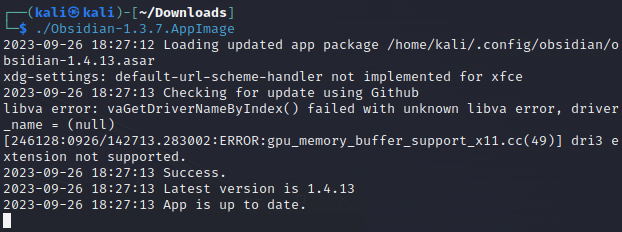

This repository serves as a comprehensive reference for all things related to ethical hacking, penetration testing, and navigating CTF challenges. 

The compilation of commands will be updated centennially.

Commands tested on Kali Linux 2023.2.

Best viewed in [Obsidian](https://obsidian.md/).

# Structure

## Toolbox
> Contains unsorted commands used by individual tools or applications

## Informational
> Contains helpful, relevant resources

## Checklists
> Contains step by step processes for specific scenarios

## Hashtag
> Useful tags meant to be used for Obsidian's graph view

# Usage with Obsidian

Copy the URL

Clone the repo

Execute Obsidian

Open Folder as Vault

# Collaborators

Thank you to those that have supported this knowledge base in any way, shape or form.

[@fungloonchong](https://github.com/fungloonchong)

[@Gjhmnjhn](https://github.com/Gjhmnjhn)

[@Theunknownswat](https://github.com/TheUnknownSwat)

[@TheSwagLord69](https://github.com/TheSwagLord69)

# Disclaimer

The information, tools, and resources provided in this repository are intended solely for educational and informational purposes related to penetration testing, ethical hacking, and capture the flag (CTF) challenges. This repository is not intended to encourage or promote any form of unauthorized access, hacking, or illegal activities.

By accessing and using the content in this repository, you acknowledge and agree to the following:

1. **Legal Compliance:** You understand that hacking, unauthorized access, and any form of cyberattack are illegal and unethical activities. You agree to abide by all local, national, and international laws and regulations that pertain to cybersecurity and computer systems.

2. **Authorized Access:** You will only perform security assessments, penetration testing, and related activities on systems and networks for which you have explicit and lawful authorization. Unauthorized testing is strictly prohibited.

3. **Liabilities:** You assume full responsibility for any actions you take based on the information provided in this repository. The creators and contributors of this repository disclaim any liability for the consequences of your actions, whether legal, financial, or otherwise.

4. **Risk Awareness:** You acknowledge that security assessments and penetration testing carry inherent risks, including unintentional damage to systems, data loss, and service disruptions. You agree to take appropriate precautions to minimize these risks.

5. **Ethical Use:** You will conduct all activities with the utmost professionalism and ethics. Your actions should aim to enhance security, identify vulnerabilities, and provide recommendations for mitigation. You will not exploit vulnerabilities for malicious purposes.

6. **No Malicious Intent:** You will not use the information, tools, or techniques provided in this repository for any malicious, harmful, or disruptive activities. You understand the importance of acting responsibly and legally.

7. **Educational Intent:** You will use this repository's content primarily for educational purposes to improve your knowledge, skills, and understanding of cybersecurity. You will not use this information to cause harm, compromise security, or engage in any illegal activities.

8. **Legal Consequences:** You understand that unauthorized access, hacking attempts, and other illegal activities can result in severe legal consequences, including but not limited to criminal charges and civil lawsuits. You agree to bear full responsibility for any legal repercussions arising from your actions.

9. **Continuous Learning:** You will stay updated on current laws, regulations, and ethical guidelines related to cybersecurity and hacking. You will adapt your practices to align with the evolving legal landscape.

10. **Responsible Sharing:** If you choose to share the knowledge gained from this repository with others, you will emphasize the importance of ethical conduct, legal compliance, and responsible hacking practices.

By using this repository, you indicate that you have read, understood, and agree to comply with these terms. If you do not agree with these terms or do not understand any part of this disclaimer, you should refrain from using the content in this repository.

Remember, ethical hacking is about promoting security and contributing positively to the digital landscape. Always act in a responsible, lawful, and ethical manner.

Use this repository to further your understanding and skills, but prioritize legal and ethical considerations in all your actions.

Stay curious, stay responsible, and pursue knowledge with integrity.

